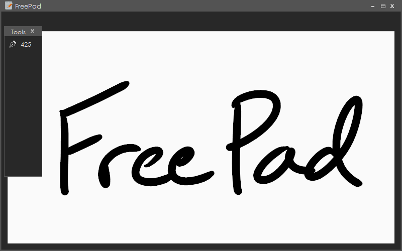

  

<h1 align="center">FreePad</h1>

<h3 align="center">
  Drawing without limits!
    
  
  
  &nbsp;&nbsp;&nbsp;&nbsp;&nbsp;&nbsp;&nbsp;&nbsp;
  
  
</h3>

<h3 align="center">
  
</h3>

 

## 🖌️ What is FreePad?

Free pad is a new, free and open source painting and drawing program that I am creating, so feel free to download it and go crazy drawing and adding your own features!
Just be sure to adhere to the [GNU General Public License](https://github.com/AMitchell-GitHub/FreePad/blob/master/LICENSE)! For more info on the license requirements, see below.

 

## ❔ Why FreePad?

FreePad is designed to have several features that are unique to this program, although [Microsoft Whiteboard](https://go.microsoft.com/fwlink/p/?LinkID=2091462&clcid=0x409&culture=en-us&country=US) is quite similar. 
Other programs that I intend to contend with on this front include Photoshop, GIMP, Paint.net, and more! 
[*Note: I don't plan to take over the market, just simply make a program that can suplement the features of these other fine programs!*]

 

## ✔️ Features:
<pre>
✔️ Infinite Canvas:
        Pan and move around - infinitely!
  
  
🔄 Adjustable brush colors and styles:
        Why not have more options? It's always nice to be able to draw colors!
  
  
❌ File system:
        PNG, JPG, PDF, and a custom filetype are all planned to be supported.
        The custom file type will be designed to keep your notes in a high-quality format, with low file sizes!
  
  
✔️ Drawing tablet support:
        This program was intended to work with drawing tablets from it's creation.
        Drawing tablets aren't just supported, but recommended!
  
  
✔️ Modern user interface:
        No one wants to use an ugly 2000's program, so FreePad has a sleek, intuitive dark mode user interface.
  
  
❌ Custom controls:
        Seriously, why don't some programs make it easy to change keybinds? The folks that make Blender understand this!
  
  
❌ Easily copy and paste images and text:
        Why do some programs make this so difficult? I just want to add a picture for heaven's sakes!
  
  
✔️ Denotes as implemented and working
🔄 Denotes an in-progress feature
❌ Denotes a feature that is planned, but is not yet in progress
</pre>

 

## 💌 A little bit of love!
Would you like to show the project a little bit of love, or maybe help out in some way? Feel free to contact me!  
Website:&nbsp;&nbsp;&nbsp;<a href="https://www.sites.google.com/site/aidanssiteofstuff">Aidan's Site of Stuffs</a> 
E-mail:&nbsp;&nbsp;&nbsp;&nbsp;&nbsp;mitchellaidan2@gmail.com 
Discord:&nbsp;&nbsp;&nbsp;`AMitchell#6193` 
PayPal:&nbsp;&nbsp;&nbsp;&nbsp;&nbsp;

 

## 📜 License
First, I should should mention that I do not own the logo to FreePad. The credit for that goes to [Paomedia](https://github.com/paomedia). 
Next, I should discuss the license for this program. According to [GNU General Public License](https://github.com/AMitchell-GitHub/FreePad/blob/master/LICENSE), you are allowed to privately use, modify, and distribute this code, on the conditions that you:
<pre>
1. State any changes made to the program.
      Seriously, why not just say what you changed?
      If it seems like people like the feature or change, I'll probably add it to the base program as well!
2. Disclose the source.
      Give me some credit. I worked hard on this after all! A link to the GitHub page would be appreciated.
3. Maintain this license, as well as the license of FreePad's logo.
      <a href="https://github.com/paomedia/small-n-flat/blob/master/LICENSE">Logo's license</a>
</pre>
